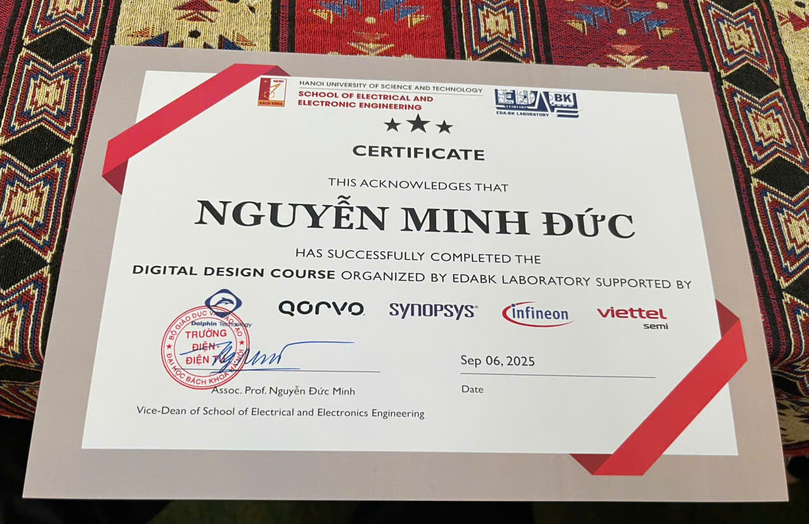

# 🚀 Project: Bộ xử lý Pipeline 5 Stage trên kiến trúc RISC-V

## 📝 Giới thiệu

⚙️ Đây là dự án thiết kế **CPU Pipeline 5 Stage** dựa trên kiến trúc tập lệnh **RISC-V (RV32I)**. 

⚙️ Mục tiêu là mô phỏng hoạt động của CPU cơ bản, có khả năng chạy được một tập lệnh của RISC-V và xử lý được các vấn đề **Hazard**.

## ⚙️ Tính năng chính

- ✅ Hỗ trợ **37/47 lệnh RV32I** (~78%)

- ✅ Pipeline gồm **5 giai đoạn**: IF, ID, EX, MEM, WB
  
- ✅ Xử lý Hazard:
  
  - **Data hazard**: Stalling & Forwarding
    
  - **Control hazard**: Branch handling cơ bản
     
- ✅ Testbench kèm nhiều chương trình mẫu để kiểm chứng
  

## 📂 Cấu trúc dự án
## 🖼️ Sơ đồ Pipeline

## 📌 Kết luận
- ✅ Đã triển khai thành công **bộ xử lý RISC-V pipeline 5 stage** bằng **Verilog**.  
- ✅ Hoạt động ổn định, chạy đúng **37/47 lệnh RV32I** (~78%).  
- ✅ Đã xử lý cơ bản **data hazard** và **control hazard**, thực hiện testbench với nhiều chương trình mẫu.  

## 🚀 Phương hướng phát triển
- [ ] Hoàn thiện hỗ trợ **47/47 lệnh RV32I**  
- [ ] Tích hợp **CSR, exception và interrupt**  
- [ ] Mở rộng hỗ trợ **RV32M** và triển khai trên **FPGA** để đo hiệu năng thực tế  
